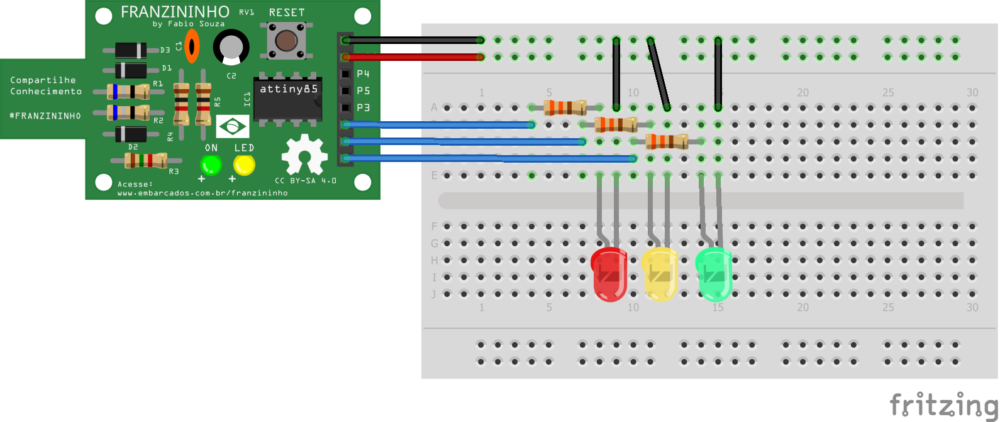

# Semáforo

Nesse exemplo vamos fazer um semáforo de uma via.

## Materiais

* Placa Franzininho;
* Protoboard;
* LED vermelho
* LED amarelo
* LED verde
* 3 Resistores 330 R
* Jumpers

## Circuito

Faça a seguinte ligação no protoboard:



Sketch

```cpp
/*
  Franzininho
  Exemplo: Semáforo

Nesse exemplo vamos fazer um semáforo de uma via.

*/


int vermelho = 2; //LED Vermelho
int amarelo = 1; //LED Amarelo
int verde = 0; //LED Verde

void setup() {
 pinMode(vermelho,OUTPUT); //define LED vermelho como Saída
 pinMode(verde,OUTPUT);   //define LED verde como Saída
 pinMode(amarelo,OUTPUT); //define LED Amarelo como Saída
}

void loop() {

  //fase 1
  digitalWrite(vermelho,HIGH);
  digitalWrite(amarelo,LOW);
  digitalWrite(verde,LOW);

  delay(5000);

  //fase 2
  digitalWrite(vermelho,LOW);
  digitalWrite(amarelo,HIGH);
  digitalWrite(verde,LOW);

 delay(1000);

 //fase 3
  digitalWrite(vermelho,LOW);
  digitalWrite(amarelo,LOW);
  digitalWrite(verde,HIGH);

  delay(5000);

}
```

