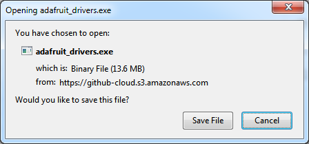
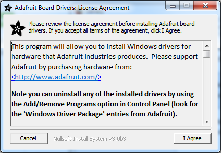
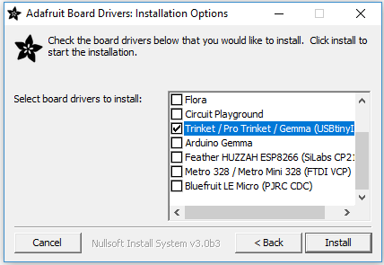
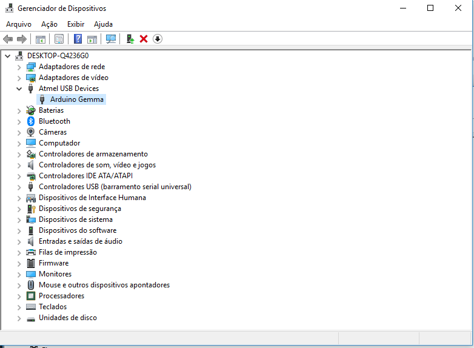

# Gemma

## Configuração dos drivers para Gemma

Se você está usando o bootloader da Arduino Gemma, sigas as orientações a seguir para a configuração do seu computador

## Windows

Antes de usar a placa você precisa instalar o driver para o Windows.

Baixe o instalador do driver: [https://github.com/adafruit/Adafruit\_Windows\_Drivers/releases/download/2.2.0/adafruit\_drivers\_2.2.0.0.exe](https://github.com/adafruit/Adafruit_Windows_Drivers/releases/download/2.2.0/adafruit_drivers_2.2.0.0.exe)

E depois instale:





Escolha a opção: Trinket / Pro Trinket / Gemma \(USBtinyISP\):



Pronto, agora insira a placa no computador e veja se a mesma é reconhecida no gerenciador de dispositivos:



Caso por algum motivo não dê certo a instalação, faça o download dos arquivos e mande instalar buscando os arquivos na pasta. Faça o [**download aqui**](http://bit.ly/franzdriver)\*\*\*\*


## Linux

Para usar com a maioria das distribuições Linux é necessário configurar algumas regras udev. Essa configura a USB para que seja programada pela Arduino IDE.

Para instalar as regras, você precisará baixá-las e copiá-las para o local das regras do udev em seu sistema. Para a maioria dos sistemas Linux, como o Ubuntu, etc., as regras do udev são armazenadas em /etc/udev/rules.d/ \(verifique a documentação da distribuição / fóruns de ajuda se você não encontrar essa pasta\). Execute os seguintes comandos:

```text
wget https://raw.githubusercontent.com/Franzininho/Franzininho-Linux/master/franzininho-gemma.rules
sudo cp franzininho-gemma.rules /etc/udev/rules.d/
```

Em seguida, você precisará recarregar as regras do udev para que elas sejam aplicadas corretamente. Você pode reiniciar sua máquina ou executar um comando como o seguinte:

```text
sudo reload udev
```

Se o comando acima falhar, tente executar:

```text
sudo udevadm control --reload-rules
sudo udevadm trigger
```

E se isso ainda falhar, reinicialize seu sistema, pois ele garantirá que o udev ative a nova configuração.

Você também pode adicionar-se ao grupo de dialout com

```text
sudo usermod -a -G dialout $USER
```

ou

```text
sudo usermod -a -G plugdev $USER
```

Fonte: [https://learn.adafruit.com/adafruit-arduino-ide-setup/linux-setup](https://learn.adafruit.com/adafruit-arduino-ide-setup/linux-setup)

**Para o Arch Linux. Contribuição por Filipe**

solucionei em partes o problema, agora é coisa besta fui na wiki do arch no udev adcionei em `/etc/udev/rules.d/50-usbtinyisp.rules`

```text
SUBSYSTEMS=="usb", ATTRS{idVendor}=="2341", ATTRS{idProduct}=="0c9f", GROUP="users", MODE="0666"
SUBSYSTEMS=="usb", ATTRS{idVendor}=="16c0", ATTRS{idProduct}=="0479", GROUP="users", MODE="0666"
```

Troquei o programador do arduino de AVRISP mkII para arduino gemma

Ê rodei o arduino como sudo, pq sem sudo msm meu usuario no grupo users não rola

## MAC OSX

Se você estiver usando o Mac OS Mavericks, Yosemite ou mais atual, talvez seja necessário atualizar a configuração para permitir a execução do Arduino IDE

1. Abra as Preferências do Sistema no Menu Apple.
2. Abra o painel de controle Segurança e Privacidade.
3. Clique na guia Geral.
4. Clique no ícone de bloqueio e faça o login
5. Alterar Permitir Aplicativos Transferidos De Para Qualquer Lugar
6. Abra o IDE baixado.
7. Volte para as preferências de segurança e mude a seleção de volta para a Mac App Store e os desenvolvedores identificados
8. Você só precisa passar por esse procedimento uma vez. Mavericks vai lembrar que não há problema em executar o aplicativo.
9. É isso aí, você está pronto para começar a usar o Arduino IDE com a placa Arduino Gemma no OSX!

Fonte: [https://learn.adafruit.com/adafruit-arduino-ide-setup/mac-osx-setup](https://learn.adafruit.com/adafruit-arduino-ide-setup/mac-osx-setup)

