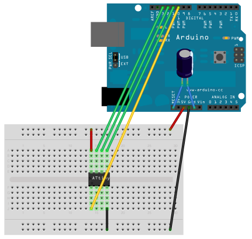
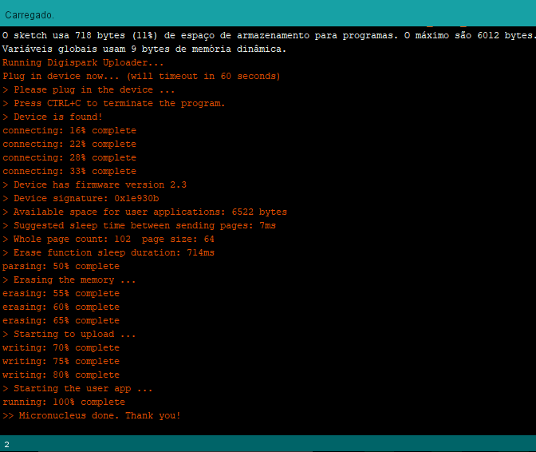
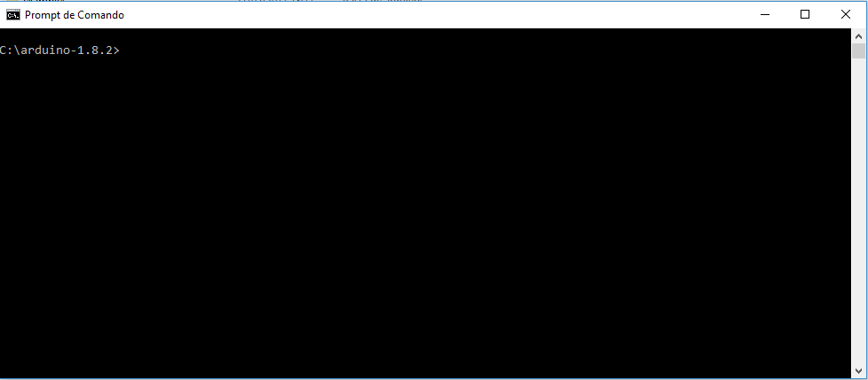

# Micronucleus

## Gravação do bootloader Micronucleus

Micronucleus é um bootloader desenvolvido para os microcotroladores AVR ATtiny que possuem restrição de interface USB, baseado na ferramenta de programação multiplataforma o libusb, e com uma grande ênfase na compactação do bootloader, sendo o menor bootloader para AVR Attiny microcontroladores.

Micronucleus é amplamente usado instalado em milhares de dispositivos de hardware de código aberto:  
[https://github.com/micronucleus/micronucleus/blob/master/Devices\_with\_Micronucleus.md](https://github.com/micronucleus/micronucleus/blob/master/Devices_with_Micronucleus.md)

Ele é opção ideal para a Franzininho e estamos trabalhando para padronizar esse bootloader para o nosso projeto \(em andamento\).

A seguir vamos exibir como você pode gravar o ATtiny85 para usar o Micronucleus

## Materiais Necessários

* Arduino UNO
* Fios \(Jumpers\)
* Protoboard

## Circuito

Você precisará fazer a seguinte ligação do ATtiny85 no Arduino UNO:

Figura 1 - Circuito para Gravação

## Preparando o Arduino como Programador USB

O primeiro passo é configurar a placa Arduino UNO como programador ISP. Para isso acesse Arquivo-&gt; Exemplos-&gt;ArduinoISP-&gt;ArduinoISP

Carregue o sketch na Arduino UNO:

Baixando o firmware do Micronucleus

Pronto, agora precisamos baixar o binário do microconucleus para gravação no ATtiny85. Você pode clonar ou baixar o repositório do [micronucleus no github](https://github.com/micronucleus/micronucleus). Ou baixar esse ZIP:

[https://github.com/micronucleus/micronucleus/archive/master.zip](https://github.com/micronucleus/micronucleus/archive/master.zip)

Salve no seu computador, descompacte e ache a pasta: micronucleus\firmware\releases. Vamos usara o arquivo: t85\_default.hex

## Gravando no Windows

Abra o prompt de comando e vá até o diretório onde está o Arduino:

Agora vamos preparar o comando para gravar usando o avrdude:

**C:\arduino-1.8.2\hardware\tools\avr/bin/avrdude** -C **C:\arduino-1.8.2\hardware\tools\avr/etc/avrdude.conf** -v -pattiny85 -cstk500v1 -P**COM3** -b19200 -Uflash:w:**C:\Users\fabio\Downloads\Arduino\micronucleus\firmware\releases/t85\_default.hex**:i

Você precisa substituir as partes em negrito no comando acima, conforme os caminhos para os arquivos em seu computador.

Verifique em qual porta a placa está conectada e substitua no comando **PCOM3**.

Certifique-se que a placa está conectada corretamente ao PC, assim como a ATtiny85 no Arduino Uno.

Copie o código e cole no prompt e pressione enter. Será iniciada a gravação:

  

No final teremos o Attiny85 com o micronucleus pronto para usar.

## Gravando no Linux

Abra o terminal:

Agora vamos preparar o comando para gravar usando o avrdude:

**/home/fabio/Downloads/arduino-1.8.5/hardware/tools/avr/bin/avrdude** -C **/home/fabio/Downloads/arduino-1.8.5/hardware/tools/avr/etc/avrdude.conf** -v -pattiny85 -cstk500v1 -P/dev/**ttyACM0** -b19200 -Uflash:w:**/home/fabio/Downloads/micronucleus-master/firmware/releases/t85\_default.hex**:i

Você precisa substituir as partes em negrito no comando acima, conforme os caminhos para os arquivos em seu computador.

Verifique em qual porta a placa está conectada e substitua no comando **ttyACM0**.No meu caso está na ttyACM0 e no seu computador pode ser diferente.

Certifique-se que a placa está conectada corretamente ao PC, assim como a ATtiny85 no Arduino Uno.

Copie o código e cole no terminal e pressione enter. Será iniciada a gravação:

Será iniciada a gravação:

No final teremos o Attiny85 com o micronucleus pronto para ser programado.

