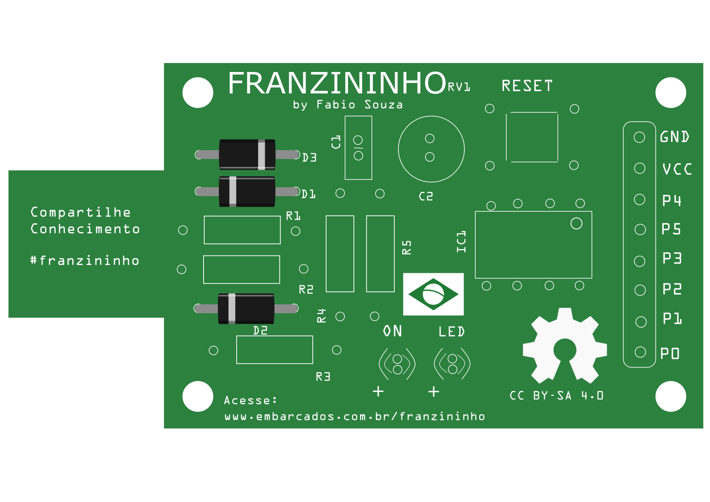
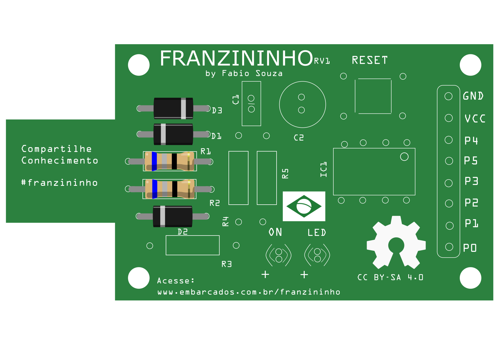
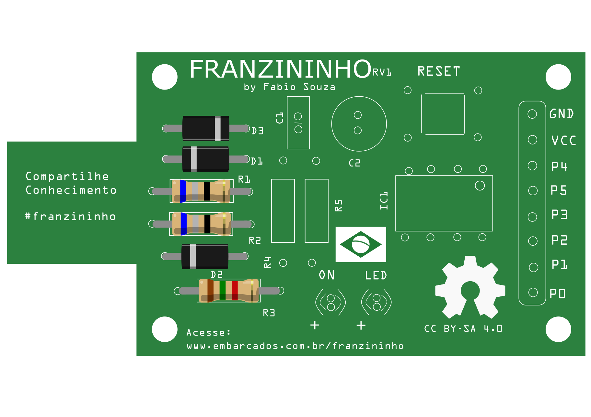
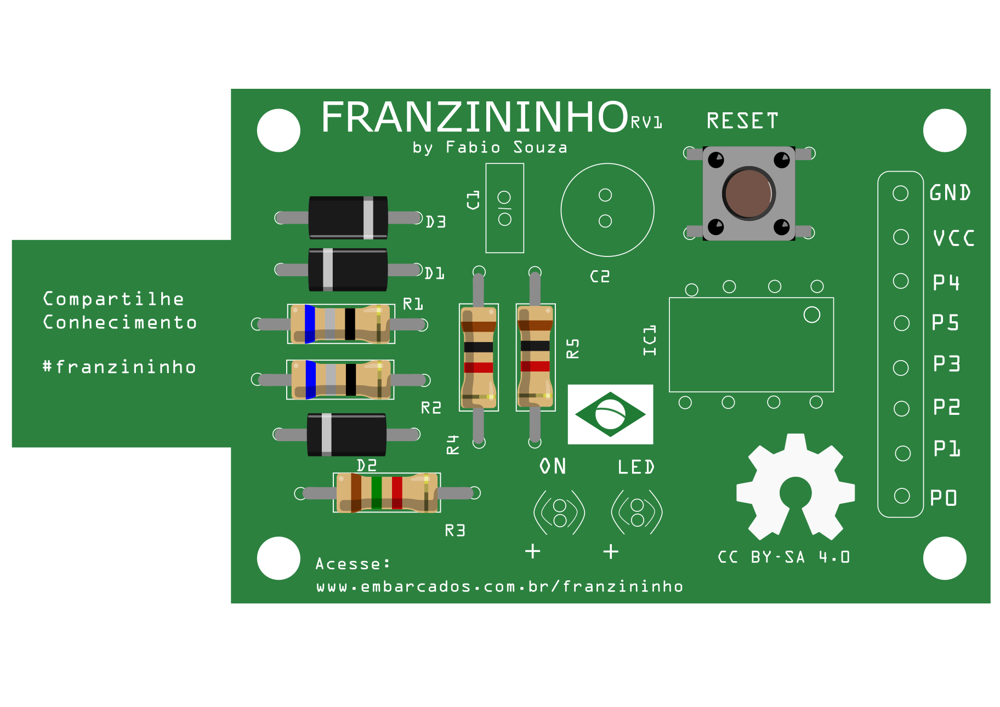
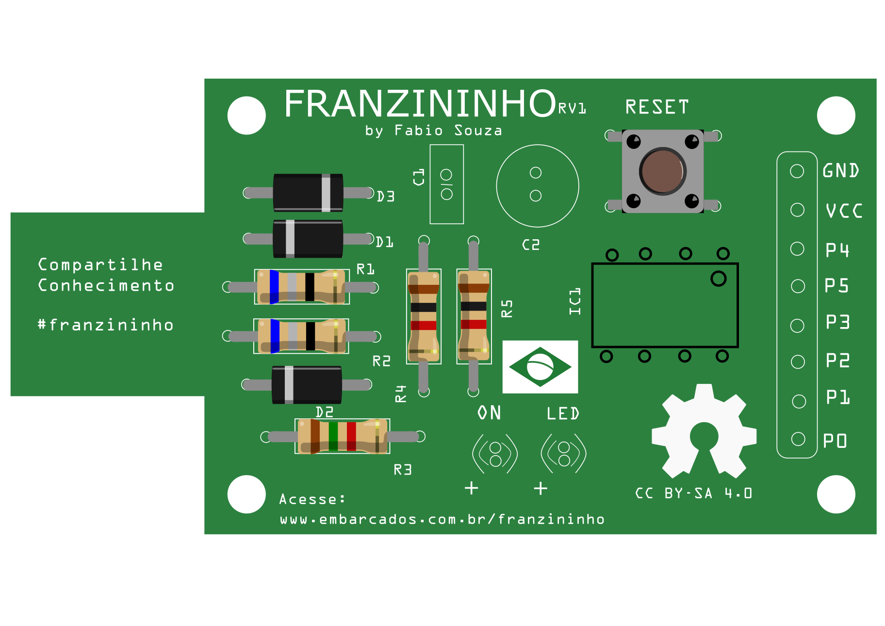

# Montando a Versão V1RV0

Antes de tudo você deve preparar o ambiente, separando as ferramentas necessárias para a soldagem, vamos precisar de:

* Ferro de solda
* Rolo de estanho
* Alicate de corte
* Óculos de proteção

**Você também deve separar os componentes para deixar organizado, para que facilite na hora de soldar. Você encontra os componentes na lista de materiais. Tudo organizados, então vamos lá?!**

### Montando a Versão V1RV0

De início você terá uma placa sem componentes, conforme a imagem abaixo:

#### **Diodo 1N1448**

Para deixarmos a montagem simples e limpa, aconselhamos primeiramente soldarmos dos diodos como na imagem abaixo. Procure na placa o local onde devemos encontrar a referência D3, onde colocaremos o Diodo 1N4148.

#### **Diodo Zener \(3V6\)**

Em seguida , devemos soldar os dois Diodos Zeners \(3V6\) nas referências D1 e D2:

#### **Resistor 68R**

Agora iremos soldar os nossos resistores, o primeiro é o resistor de 60 ohms \(as cores de marcação são azul, cinza, preto e dourado\), este deve ser soldado na referência R1. O segundo resistor tem a mesma resistência \(68 ohms\) e deverá ser soldado em paralelo ao primeiro onde encontramos a referência R2.

#### **Resistor 1K5**

R3 deve-se colocar o resistor 1k5 que é representado nas cores \(Marron,verde,vermelho,dourado\)

#### **Resistores 1K**

Resistores 1K que é representado nas cores \(Marrom, preto, vermelho,dourado\), nas referências R4 e R5.

#### **Chave tactil**

A chave você consegue colocar em apenas uma posição, então é só encaixa-la.

#### **Soquete 8 pinos**

O soquete deve ser colocado no IC1 que tras a facilidade do encaixe do Attiny85

#### **Capacitor Cerâmico**

No C1 você irá colocar o capacitor cerâmico.

#### **LED Verde**

O Led verde deve ser colocado no ON

#### **LED Amarelo**

#### **Capacitor eletrolitico**

C2 vamos colocar o capacitor eletrolitico

#### **Barra de 8 pinos**

Referente ao \(GNG, VCC, P6 ...P1,P0\)

#### **Attiny85**

Por último iremos colocar o microcontrolador Attiny85

Pronto!

Agora a Franzininho versão 1 está pronta, agora precisamos programá-la.  

