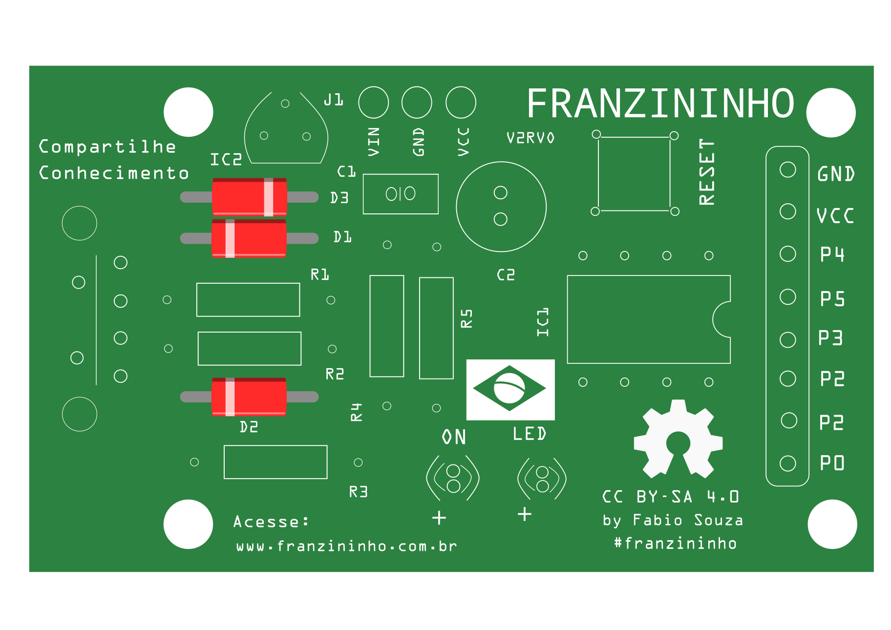
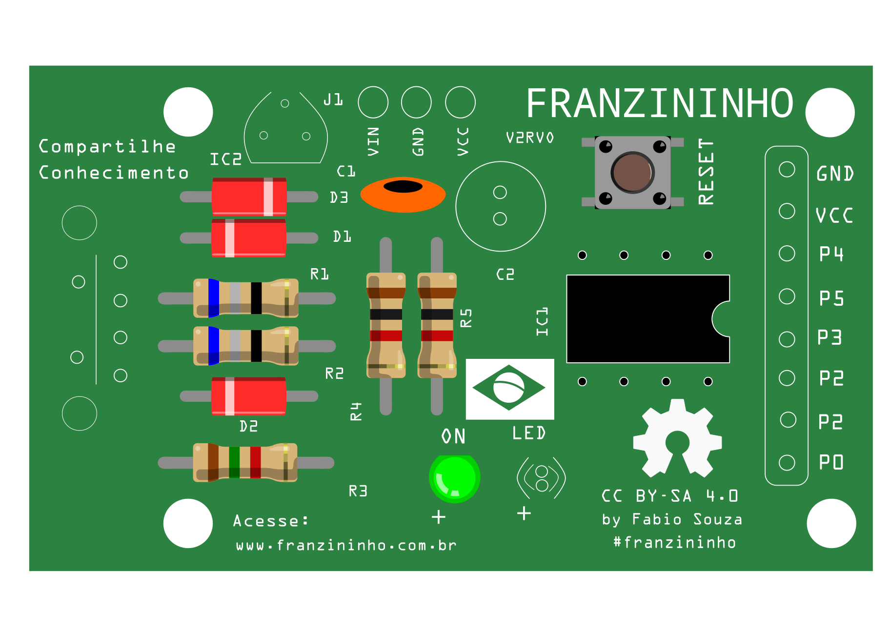
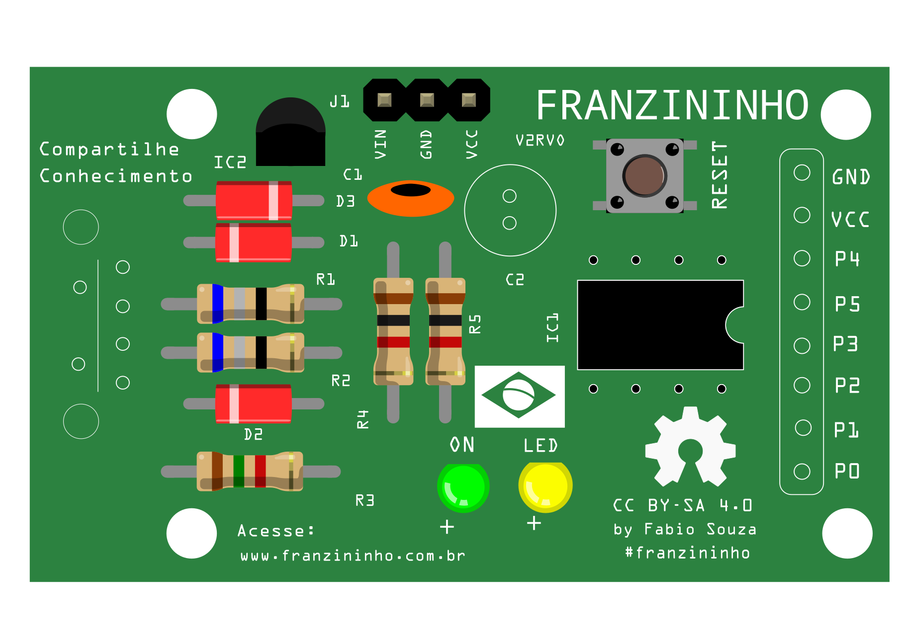
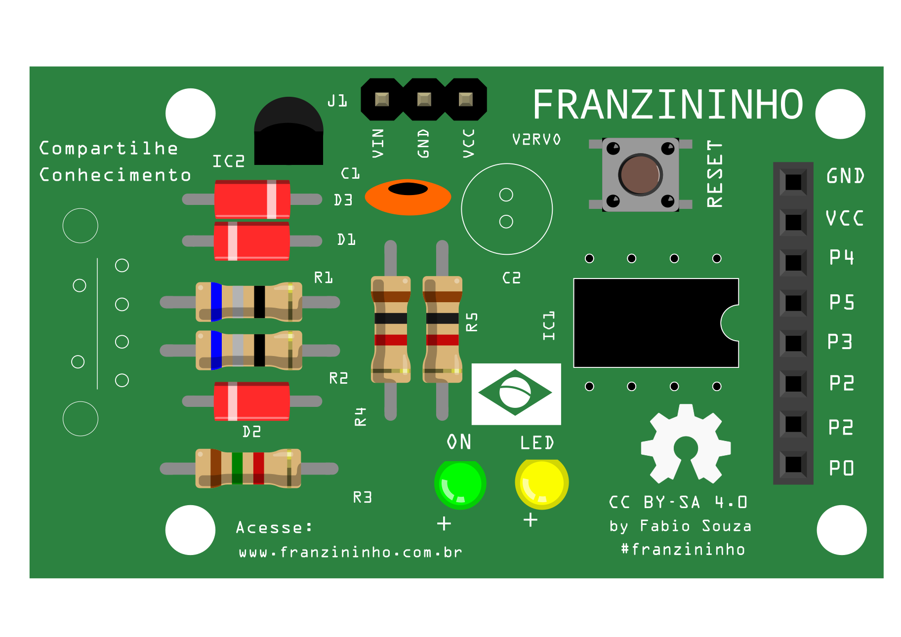
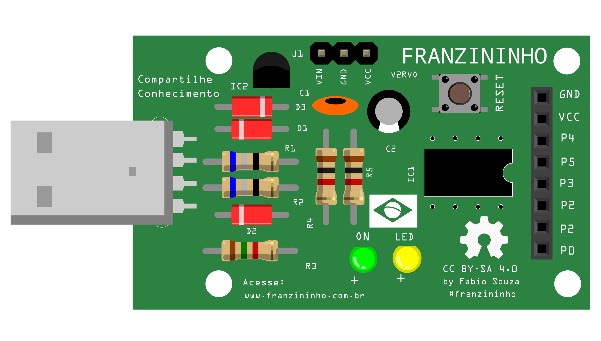

# Montando a Versão V2RV0

Antes de tudo você deve preparar o ambiente, separando as ferramentas necessárias para a soldagem, vamos precisar de:

* Ferro de solda
* Rolo de estanho
* Alicate de corte etc.
* Óculos de proteção

Você também deve separar os componentes para deixar organizado, para que facilite na hora de soldar. Você encontra os componentes na lista de materiais. Tudo organizados, então vamos lá?!

### **Montando a Versão V2RV0** 

De início você terá uma placa sem componentes, conforme a imagem abaixo:

Você deve sempre começar pelos componentes baixos, você pode seguir conforme o modelo abaixo:

**Diodo 1N1448**

Primeiro componente a ser colocado é o Diodo 1N4148 no D3, cuidando com a polaridade dele, você vai entender que a faixa preta do diodo deve ser colocado conforme o desenho da placa.

 **Diodos Zener \(3V6\)**

Temos dois diodos zener, onde deverão ser colocados nas referências D1 e D2 lembre-se da polaridade dele, coloque do lado certo!

**Resistores 68R**

Nas referências R1 e R2 você irá colocar o resistor 68R que é representado pelas cores \(Azul,cinza,preto,dourado\)

**Resistor 1K5**

R3 deve-se colocar o resistor 1k5 que é representado nas cores \(Marrom, verde,vermelho,dourado\)

 **Resistores 1K**

Resistores 1K que são representados nas cores \(Marrom, preto, vermelho,dourado\) deve-se colocar no R4 e R5.

**Soquete 8 pinos**

O soquete deve ser colocado no IC1 que trás a facilidade do encaixe do Attiny85

**Chave táctil**

A chave você consegue colocar apenas uma posição, então é só encaixa-la

**Capacitor Cerâmico**

No C1 você irá colocar o capacitor cerâmico.

**LED Verde**

O LED verde deve ser colocado no ON

**LED Amarelo**

O LED amarelo deve ser colocado no LED

**Regulador de tensão**

No IC2 você deve colocar o regulador, ele tem 3 terminais você deve colocar conforme o desenho na placa.

**Barra de 3 pinos**

J1 aonde está referenciado com VIN, GND, VCC você irá colocar a barra com três pinos

**Barra de 8 pinos**

Referente ao \(GNG, VCC, P6 ...P1,P0\)

**Capacitor eletrolítico**

Agora  vamos colocar o capacitor eletrolítico

**Conector USB**

Por penúltimo iremos colocar o conector USB, conforme o encaixe dele.

**Attiny85**

Por último iremos colocar o microcontrolador Attiny85

Pronto!

Sua Franzininho versão 2 está montada, agora é só programar e criar vários projetos.

