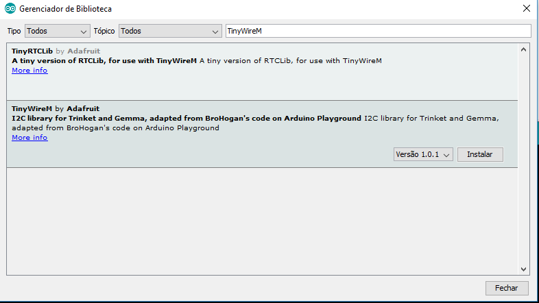
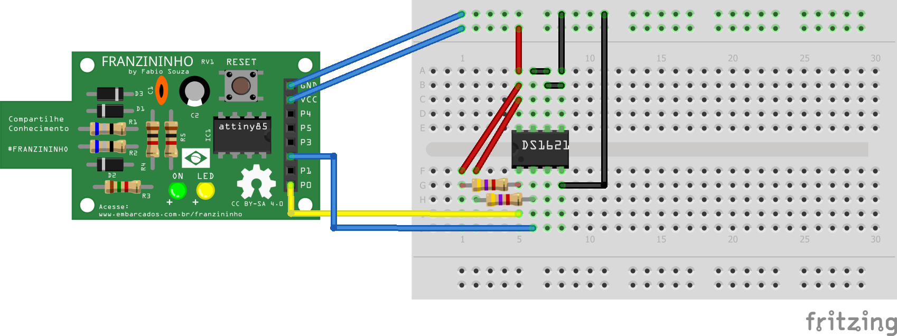

# I2C

A biblioteca Wire usada para aplicações I2C não é compatível com o ATtiny85. Para a função de I2C podemos usar a biblioteca TinyWireM, disponibilizada pela Adafruit. Você pode baixá-la no [github](https://github.com/adafruit/TinyWireM) ou instalar através do gerenciador de bibliotecas no Arduino:



Os pinos da I2C na Franzininho são: P0\(SDA\) e P2\(SCL\), conforme pinout:


## Exemplo

Leitura do sensor de temperatura DS1620



```cpp
/* ATtiny85 as an I2C Master  Ex1          BroHogan                      1/21/11
 * I2C master reading DS1621 temperature sensor. (display with leds)
 * SETUP:
 * ATtiny Pin 1 = (RESET) N/U                      ATtiny Pin 2 = (D3) LED3
 * ATtiny Pin 3 = (D4) to LED1                     ATtiny Pin 4 = GND
 * ATtiny Pin 5 = SDA on DS1621                    ATtiny Pin 6 = (D1) to LED2
 * ATtiny Pin 7 = SCK on DS1621                    ATtiny Pin 8 = VCC (2.7-5.5V)
 * NOTE! - It's very important to use pullups on the SDA & SCL lines!
 * DS1621 wired per data sheet. This ex assumes A0-A2 are set LOW for an addeess of 0x48
 * TinyWireM USAGE & CREDITS: - see TinyWireM.h
 * NOTES:
 * The ATtiny85 + DS1621 draws 1.7mA @5V when leds are not on and not reading temp.
 * Using sleep mode, they draw .2 @5V @ idle - see http://brownsofa.org/blog/archives/261
 */

#include <TinyWireM.h>                  // I2C Master lib for ATTinys which use USI

#define DS1621_ADDR   0x48              // 7 bit I2C address for DS1621 temperature sensor
#define LED1_PIN         4              // ATtiny Pin 3
#define LED2_PIN         1              // ATtiny Pin 6
#define LED3_PIN         3              // ATtiny Pin 2

int tempC = 0;                          // holds temp in C
int tempF = 0;                          // holds temp in F


void setup(){
  pinMode(LED1_PIN,OUTPUT);
  pinMode(LED2_PIN,OUTPUT);
  pinMode(LED3_PIN,OUTPUT);
  Blink(LED1_PIN,2);                    // show it's alive
  TinyWireM.begin();                    // initialize I2C lib
  Init_Temp();                          // Setup DS1621
  delay (3000);
}


void loop(){
  Get_Temp();
  Blink(LED1_PIN,tempC/10);             // blink 10's of temperature on LED 1
  delay (1000);
  Blink(LED2_PIN,tempC%10);             // blink 1's of temperature on LED 2
  delay (4000);                         // wait a few sec before next reading
}


void Init_Temp(){ // Setup the DS1621 for one-shot mode
  TinyWireM.beginTransmission(DS1621_ADDR);
  TinyWireM.send(0xAC);                 // Access Command Register
  TinyWireM.send(B00000001);            // Using one-shot mode for battery savings
  //TinyWireM.send(B00000000);          // if setting continious mode for fast reads
  TinyWireM.endTransmission();          // Send to the slave
}


void Get_Temp(){  // Get the temperature from a DS1621
  TinyWireM.beginTransmission(DS1621_ADDR);
  TinyWireM.send(0xEE);                 // if one-shot, start conversions now
  TinyWireM.endTransmission();          // Send 1 byte to the slave
  delay(750);                           // if one-shot, must wait ~750 ms for conversion
  TinyWireM.beginTransmission(DS1621_ADDR);
  TinyWireM.send(0xAA);                 // read temperature (for either mode)
  TinyWireM.endTransmission();          // Send 1 byte to the slave
  TinyWireM.requestFrom(DS1621_ADDR,1); // Request 1 byte from slave
  tempC = TinyWireM.receive();          // get the temperature
  tempF = tempC * 9 / 5 + 32;           // convert to Fahrenheit
}


void Blink(byte led, byte times){ // poor man's GUI
  for (byte i=0; i< times; i++){
    digitalWrite(led,HIGH);
    delay (400);
    digitalWrite(led,LOW);
    delay (175);
  }
}
```

Fonte: [TinyWireM](https://github.com/adafruit/TinyWireM)

