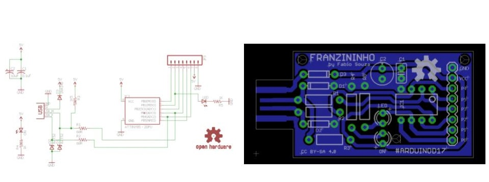
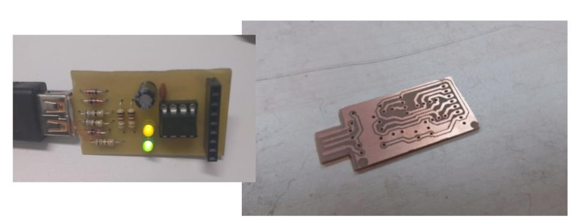
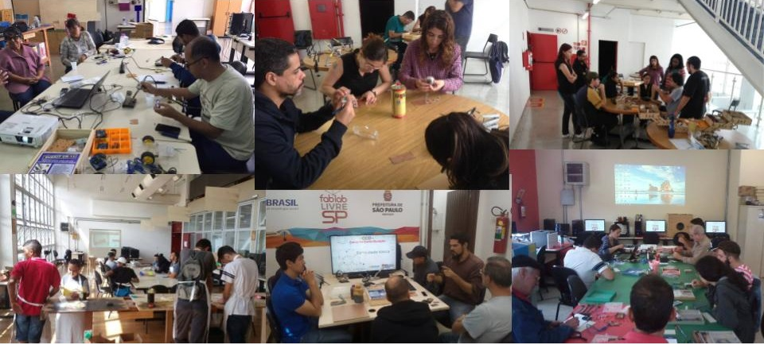
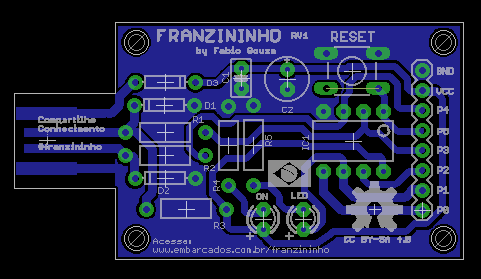
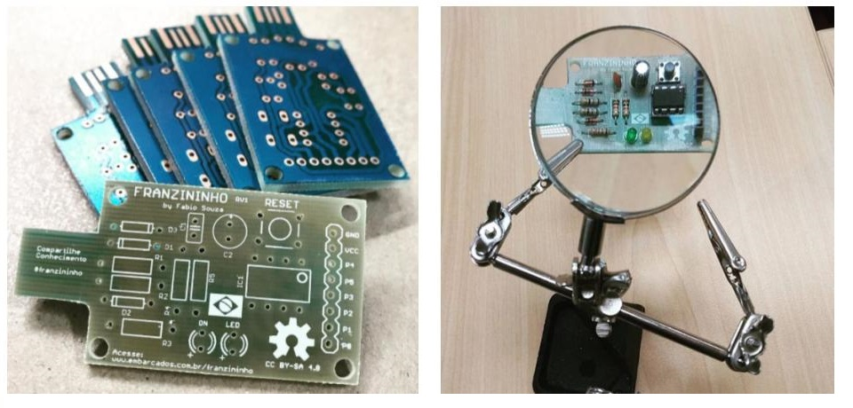
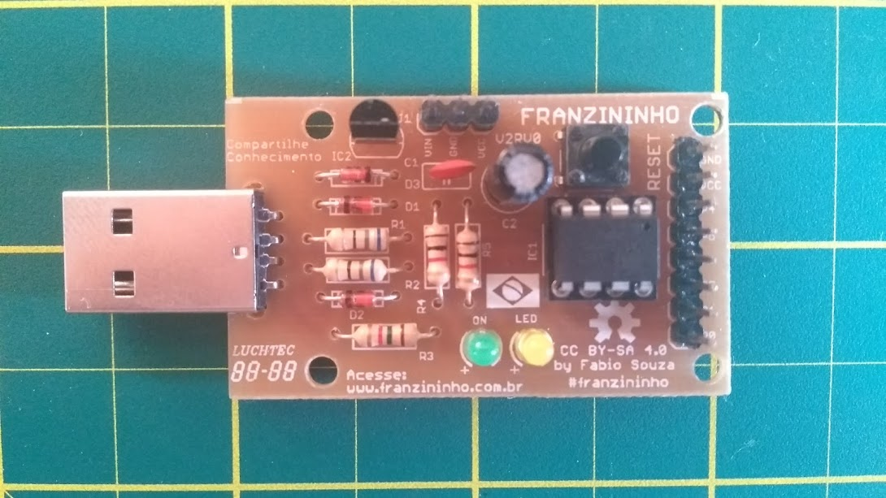

# Sobre o Projeto Franzininho

## Concepção e desenvolvimento

A Franzininho foi desenvolvida para as atividades dentro do [FAB LAB Livre SP](http://www.fablablivresp.art.br/arduinoday) durante o [Arduino Day São Paulo 2017](http://arduinosaopaulo.cc/). [Thalis Antunes](https://www.linkedin.com/in/thalis-antunes-de-souza-a87a3035/) e [Fábio Souza ](https://about.me/fabio.souza)conceberam o projeto a partir do desafio de realizar atividades simultâneas nos 12 FABLABs livres em SP, em um Arduino Day realizado pela Prefeitura de São Paulo e com apoio de Embarcados, Fazedores e MinasUP. Como as atividades teriam apoio do ITS com os materiais, chegou-se a conclusão que seria melhor fazer placas compatíveis com Arduino para as pessoas montarem e terem experiência com solda. A condição era que o projeto fosse open hardware. A partir dos projetos de hardwares das placas Arduino Gemma e Digispark \(placas open hardware\) desenvolveu-se uma placa com componentes discretos e em face simples.

O circuito foi projetado pensando na fabricação usando maquinas CNCs ou através de processo de corrosão de PCI. Os 30 técnicos se empenharam adaptaram o layout da Franzininho para o método de fabricação que tinham mais facilidade, foram feitas placas de diversas formas.

No dia 01/04/17 \(Dia do Arduino 2017\) foram produzidas 300 placas dentro dos 12 FAB LABs Livres SP. Foi incrível!

## Continuação pós Arduino Day

Após o Arduino Day, o layout da PCB foi melhorado onde foram incluídos mais 2 furos e ajustado o tamanho da placa. Também foi melhorado o silk e incluída a bandeira do Brasil.

Para continuar, tínhamos o desafio de conseguir placas para novas oficinas, já que não é todo mundo que tem acesso a ferramentas de fabricação digital ou métodos caseiros. Para viabilizar a fabricação de placas Franzininho em uma empresa especializada, foi lançada uma espécie de compra coletiva pela comunidade, liderada por Fábio Souza. Nesta iniciativa foram feitas 600 placas, onde as pessoas tiveram acesso a placas com acabamento industrial.

Dessas 600 placas diversas foram usadas para oficinas em hackerspaces, oficinas de solda, eventos. Com isso a comunidade só ganhou força.

Com isso surgiram diversas contribuições da comunidade para o projetos, como: materiais para oficinas, layout, projetos e principalmente na documentação. A comunidade está crescendo cada vez mais e com diversas iniciativas.

## Franzininho V2

Após um período trabalhando com a Franzininho V0RV1, foi desenvolvida uma nova versão com conector USB. Essa nova versão resolveu 2 problemas: facilitou a fabricação e orientação da placa ao conectá-la no computador.

A pinagem e funcionamento das duas versões são as mesmas.

## Comunidade

 Atualmente o projeto é liderado por [Fábio Souza](https://medium.com/@fabiosouza) e [Diana Santos](https://medium.com/@dianaipsantos91), com apoio da [comunidade](https://www.facebook.com/groups/299236843857849/). Todos os materiais desenvolvidos são publicados com licenças open source e publicamente, o que permitem que todos tenham acesso e possam usar como quiserem.

## Licença de Hardware da Franzininho

O Hardware Franzininho foi publicada com a licença CC-SA-4.0, sendo um projeto open hardware que permite que qualquer pessoa possa:

* Estudar;
* Modificar;    
* Construir,    
* distribuir;    
* ou vender

A proposta é que todos os interessados possam montar o seu Arduino compatível, entender como funciona o circuito, fazer projetos e contribuir para o desenvolvimento de um projeto open source.

> O nome Franzininho foi dado em continuação a placa open hardware que o Fábio Souza fez para sua palestra no Arduino Day de 2016, a [Franzino](https://github.com/FBSeletronica/Franzino).

## Aviso Legal

O projeto é open hardware e publicado com uma licença que permite a venda por empresas sem a necessidade de pagar royalties ou obrigação de contribuir para a comunidade.

As placas e kits oferecidos no comércio, são de responsabilidade das empresas que estão comercializado. Assim como o valor e negociação deve ser feito com eles.

Qualquer material comercializado, oficinas, e projetos feitos com Franzininho são de responsabilidade das pessoas e empresas que estão a frente da negociação.


Nós tentaremos ficar em cima para manter a qualidade e metodologia de aplicação do projeto, porém não podemos garantir que as mesmas sejam garantidas. Sendo assim, caso tenha algum problema, antes de atacar o projeto Franzininho ou os seus idealizadores, verifique se não foi um problema da empresa ou responsável a frente da atividade.


O projeto está em constante atualização, e está só no começo. Fica o convite para qualquer pessoa que queira colaborar, aprender, criar novas placas, para interagir na comunidade. Apesar de ser um projeto de hardware, diversas áreas podem somar para o projeto.

